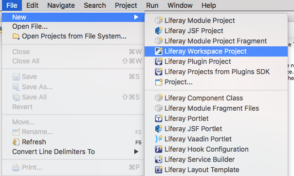
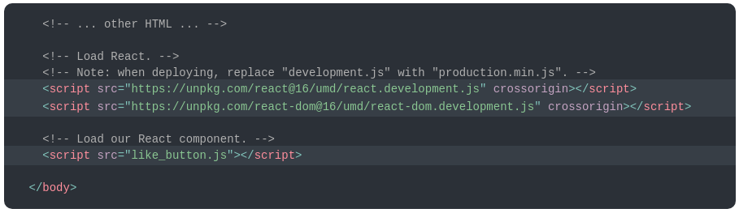
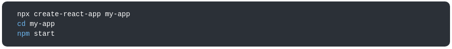
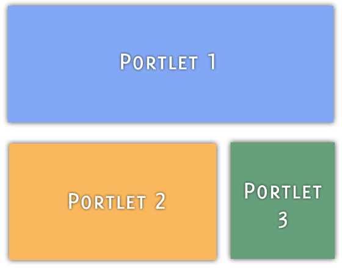
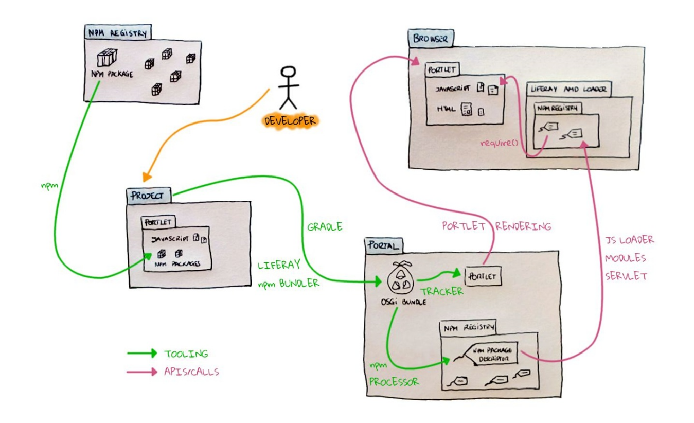
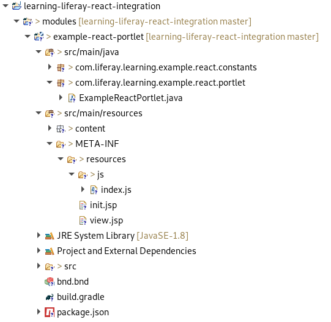
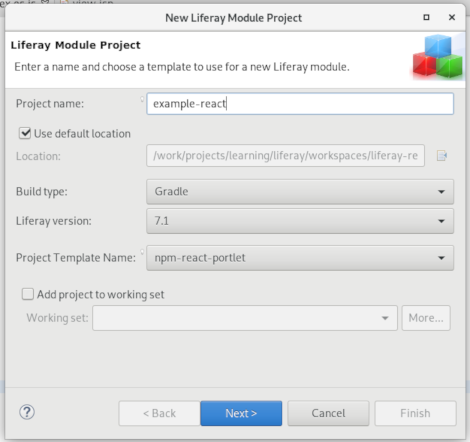

<!-- 
	footer: Created By Davide Gulli - https://github.com/davidegulli
	page_number: true 
-->

# Liferay React Portlet

Dalla versione 7.0 GA5 è possibile sviluppare portlet liferay utilizzando il framework javascript React

---

# Argomenti


- Introduzione al tool di build __liferay-npm-bundler__
- Anatomia di un modulo __Liferay React Portlet__
- Creazione di un modulo __Liferay React Portlet__
- Sviluppo di un esempio pratico

---

# Di cosa abbiamo bisogno


- Liferay 7.1 CE GA3 (https://sourceforge.net/projects/lportal/files/Liferay%20Portal/7.1.2%20GA3/liferay-ce-portal-tomcat-7.1.2-ga3-20190107144105508.7z/download)
- Liferay Developer Studio & Blade CLI (https://sourceforge.net/projects/lportal/files/Liferay%20IDE/3.5.0/)

---

# Avvio Liferay

per avviare liferay e testare l'installazione è necessario eseguire il seguente file: _LIFERAY_HOME/bin/startup_

per verificare che l'installazione sia andata a buon fine aprire il browser e puntare al seguente url: _http://localhost:8080/_

E'  possibile fare login usando le seguenti credenziali:
__User:__ test@liferay.com
__Password__: test

---

# Installazione IDE & Blade CLI

A seconda del OS sul quale si lavora seguire le istruzioni presenti al seguente link: https://dev.liferay.com/fr/develop/tutorials/-/knowledge_base/7-1/installing-liferay-ide 

---

# Creazione di un liferay  workspace

Per poter poter  sviluppare moduli liferay è molto utile usare un liferay workspace.

Si può creare usando Liferay Developer Studio: 

# 

---

# Configurare il liferay workspace

All'interno del liferay workspace è necessario modificare il file: _gradle-local.properties_ inserendo la seguente property:

``` properties
liferay.workspace.home.dir=[LIFERAY_HOME]
```
Il placeholder [LIFERAY_HOME] deve essere sostituito con il percorso assoluto della cartella che ospita l'installazione locale di liferay, nel mio caso: 

``` java
/work/projects/learning/liferay/bundles/liferay-portal-7.1.2-ga3
```

---

# Setup React Application no Liferay

Static Import


Toolchains


---

# Liferay Page 

Una pagina liferay è composta da più "web application" ognuna con le sue risorse statiche (js, css, images...)



---

# liferay-npm-bundler

La definizione di Liferay:
> _The liferay-npm-bundler is a bundler (like Webpack or Browserify ) that targets Liferay Portal as a platform and assumes you’re using your npm packages from portlets (as opposed to typical web applications)._

---

# liferay-npm-bundler

In buona sostanza si tratta di un tool che prende in input un portlet project e restituisce in output, nella cartella build, tutti i file necessari, compresi gli npm packages, così che la gradle build standard liferay, possa produrre un OSGI Bundle che implementi una o più portlet basate uno specifico framework javascript.

--- 

# liferay-npm-bundler flow

# 

---

# Anotomia di una Liferay React Portlet

- è un bundle osgi composto da almeno un __osgi service__ (ovvero una classe java che implementa una portlet) e una serie di __resources__: javascript, css, jsp

---

# 

---

# Creazione modulo Liferay React Portlet

Per creare un modulo che contenga una o più __Liferay React Portlet__ abbiamo due vie, utilizzare l'ide Liferay Developer Studio oppure da linea di comando attraverso BladeCLI.
Entrambi i tool sfruttano il project template _npm-portlet-react_: https://dev.liferay.com/fr/develop/reference/-/knowledge_base/7-1/npm-react-portlet-template
  
  
__Note:__ inoltre attraverso un achetype specifico è possibile usare anche maven

---

# Creare npm-react-portlet con Blade CLI
__Comando:__

``` bash 
blade create -t npm-react-portlet \
             -p [package-name] \
             -c [portlet-class-name] 
             [module-name]
```
__Esempio:__

``` bash 
blade create -t npm-react-portlet \
             -p com.liferay.learning.example.react \
             -c ExampleReact 
             example-react-portlet
```

---

# Creare npm-react-portlet con Liefray Developer Studio

_File -> New -> Liferay Module Project_



---

# Build & Deploy npm-react-portlet con Blade CLI
__Comandi:__

``` bash 
$ blade gw build
```
``` bash 
$ blade gw clean
```
``` bash 
$ blade gw deploy
```

__Nota:__ E' interessante notare come dopo la build del modulo, nella cartella del progetto, effettuando un refresh, comparirà la cartella: _node_modules_ ed il file: _package-lock.json_

--- 

# liferay-npm-bundler Configuration File

Ogni workspace liferay viene creato con un _configuration preset_ di default per il nostro npm-bundler, ma è possibile creare una nuova configurazione o estendere la configurazione di default agendo sui seguenti file:

- .npmbundlerrc
- .babelrc

__Reference:__
https://portal.liferay.dev/docs/7-1/reference/-/knowledge_base/r/configuring-liferay-npm-bundler

---

# liferay-npm-bundler

In fase di build il bundler compie diverse operazioni tra cui:

- rendere i moduli javascript compatibili con il __Liferay AMD Loader__
- creare la struttura dei moduli all'interno della cartella __node_modules__

---

# Module Naming

La gestione dei moduli js in liferay ruota intorno a dei concetti specifici:

- nomenclatura
- inline packages (liferay-npm-bundler 2.x)
- package de-duplication (liferay-npm-bundler 1.x)
- isolated package dependencies (liferay-npm-bundler 2.x)
- importing packages (liferay-npm-bundler 2.x)


http://localhost:8080/o/js/module/994/react@16.8.6/index.js

---

# liferay-npm-bundler 1.x  versus 2.x

All'interno del file _package.json_ troviamo l'indicazione di quale versione del liferay-npm-bundler si sta utilizzando.

Mentre al seguente link è presente il change log che mette in evindenza le differenze tra le due versioni

https://portal.liferay.dev/docs/7-1/reference/-/knowledge_base/r/changes-between-liferay-npm-bundler-1x-and-2x

---

# Sviluppiamo una semplice portlet react

L'obbiettivo è sviluppare una semplice portlet react che visualizzi l'elenco dei Siti presenti all'interno dell'istanza liferay corrente.

Per cuperare tali dati utilizzare le api jsonws di liferay:

http://localhost:8080/api/jsonws

Per effettuare le chiamate rest avremo bisogno di recuperare i seguenti dati:

- company id
- authentication token

---

Materiale disponibile al seguente link:

https://github.com/davidegulli/learning-liferay-react-integration


