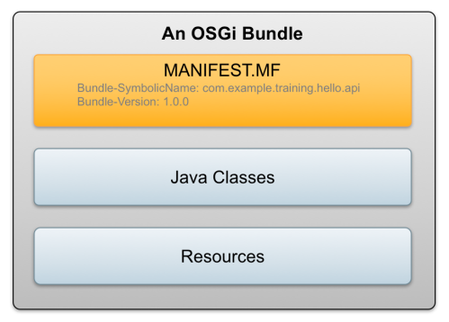

<!-- 
	footer: Created By Davide Gulli - https://github.com/davidegulli
	page_number: true 
-->

# Liferay React Portlet

Dalla versione 7.0 GA5 è possibile sviluppare portlet liferay utilizzando il framework javascript React

---

# Argomenti

- Configurazione ambiente di sviluppo
- Introduzione a Liferay e alla modularizzazione OSGI
- Introduzione dei concetti di Bundle e Component
- Introduzione al tool di build __liferay-npm-bundler__
- Anatomia di un modulo __Liferay React Portlet__
- Creazione di un modulo __Liferay React Portlet__
- Introduzione alle nuove rest api liferay
- Sviluppo di un esempio pratico

---

# Di cosa abbiamo bisogno

- JDK 8 installata e configurata
- Un database (mysql o postgres)
- Liferay 7.1 CE GA3 (https://sourceforge.net/projects/lportal/files/Liferay%20Portal/7.1.2%20GA3/liferay-ce-portal-tomcat-7.1.2-ga3-20190107144105508.7z/download)
- Liferay Developer Studio & Blade CLI (https://sourceforge.net/projects/lportal/files/Liferay%20IDE/3.5.0/)

---

# Configuriamo l'ambiente di sviluppo

Per prima cosa cloniamo il repository GitHub contenente gli esempi ed altri utili file:

  
    
``` bash
$ git clone https://github.com/davidegulli/learning-liferay-react-integration
```

---

# Verifichiamo l'installazione della JDK

Eseguendo il seguente comando:
``` bash
$ java -version
```
dovrò visualizzare un output simile a questo:
```bash
java version "1.8.0_191"
Java(TM) SE Runtime Environment (build 1.8.0_191-b12)
Java HotSpot(TM) 64-Bit Server VM (build 25.191-b12, mixed mode)

```

---

# Configurazione Database

### Creare un nuovo database e un nuovo utente
__Nome database:__ liferay
__Nome Utente:__ liferay
__Password Utente:__ liferay

Note: 
- il database deve essere creato con il charset: UTF-8
- all'utente liferay devono essere assegnate tutte le GRANT sul database liferay

---

# Comandi Postgres

``` bash
$ su - postgres
$ create user [username] with encrypted password '[password]';
$ create database [database] encoding 'UTF8';
$ grant all privileges on database [database] to [username];

```

---

# Installazione Liferay

1. copiare il file: liferay-ce-portal-tomcat-7.1.2-ga3-20190107144105508.7z all'interno della cartella che desideriamo
2. decomprimere il file. Da ora in poi ci riferiremo alla cartella _liferay-ce-portal-7.1.2-ga3_ come LIFERAY_HOME
3. copiare i _portal-ext.properties_, _portal-developer.properties_, _portal-runtime.properties_ dalla cartella: 
_learning-liferay-react-integration/configs/dev/_ 
all'interno della cartella LIFERAY_HOME 
4. modifcare i puntamenti ai percorsi locali all'interno del file: _portal-ext.properties_

---

# Abilitazione modulo APIO

1. copiare il file: 
__/learning-liferay-react-integration/configs/dev/osgi/config/com.liferay.apio.architect.internal.application.ApioApplication-default.config__ 
all'interno della cartella:
__LIFERAY_HOME/osgi/configs__

---

# Avvio Liferay

per avviare liferay e testare l'installazione è necessario eseguire il seguente file: _LIFERAY_HOME/bin/startup_

per verificare che l'installazione sia andata a buon fine aprire il browser e puntare al seguente url: _http://localhost:8080/_

E'  possibile fare login usando le seguenti credenziali:
__User:__ test@liferay.com
__Password__: test

---

# Installazione IDE & Blade CLI

A seconda del OS sul quale si lavora seguire le istruzioni presenti al seguente link: https://dev.liferay.com/fr/develop/tutorials/-/knowledge_base/7-1/installing-liferay-ide 

---

# Creazione di un liferay  workspace

Per poter poter  sviluppare moduli liferay è molto utile usare un liferay workspace.

Si può creare usando Liferay Developer Studio: 

# 

---

# Configurare il liferay workspace

All'interno del liferay workspace è necessario modificare il file: _gradle-local.properties_ inserendo la seguente property:

``` properties
liferay.workspace.home.dir=[LIFERAY_HOME]
```
La stringA [LIFERAY_HOME] deve essere sostituita il percorso assoluto della cartella che ospita l'installazione locale di liferay

---

# Modularità con OSGI

- L'acronimo OSGI sta per _Open Service Gateway Initiative_
- E' una specifica ed un insieme di standard per lo sviluppo modulare in java
- Ha diverse implementazioni: Apache Foundation, Eclipse Foundation...

---

# Liferay & OSGI

- L'intera architettura liferay dalla versione 7.0 in poi si basa su la tecnologia OSGI
- Per poter sviluppare in liferay è mandatoria capire i concetti base della tecnologia OSGI

---

# Concetti Base

- OSGI Framework
  - L'insieme di servizi ed API che costituiscono l'ambiente di runtime di un'applicazione OSGI
- Bundle
- Component
- Service

---

# Che cos'è un Bundle OSGI

- Sono i mattoncini che compongono un'applicazione OSGI
- Si tratta di un file jar che contiene un file MANIFEST.MF con degli specifici headers

# 

---

# Che cos'è un Component?

- Si tratta di una classe java che ha specifiche annotation al suo interno

``` java

package com.liferay.learning.example.component;

import java.util.Map;
import org.osgi.service.component.annotations.Activate;
import org.osgi.service.component.annotations.Component;

@Component
public class ExampleComponent {

	@Activate
	protected void activate(Map properties) {
		System.out.println("I'm a component and I'm active!")
	}
}
```
---

# Che cos'è un Service?

- E' un __component__ registrato all'interno del __service registry__
- Implementa sempre un __interfaccia__

---

``` java
package com.liferay.learning.example.service.impl;

import com.liferay.learning.example.api.ExampleService;
import org.osgi.service.component.annotations.Component;

@Component(
	service = ExampleService.class
)
public class ExampleServiceImpl implements ExampleService {

	@Override
  	public String getEmployeeName() {
		return _name;
	}

	@Override
	public void setEmployeeName(String name) {
		_name = name;
	}

	private String _name;
	}
```

---

# liferay-npm-bundler

La definizione di Liferay:
> _The liferay-npm-bundler is a bundler (like Webpack or Browserify ) that targets Liferay Portal as a platform and assumes you’re using your npm packages from portlets (as opposed to typical web applications)._

---

# liferay-npm-bundler

In buona sostanza si tratta di un tool che prende in input un portlet project e restituisce in output nella cartella build tutti i file necessari compresi, gli npm packages, per mettere a disposizione della portlet uno specifico framework javascript.

--- 

# liferay-npm-bundler flow

# 

---

# Anotomia di una Liferay React Portlet

- è un bundle osgi composto da almeno un __service__ ovvero una classe che implementa la portlet e una serie di __resources__: javascript, css, jsp

---

# 

---

# Creazione modulo Liferay React Portlet

Per creare un modulo che contenga una o più __Liferay React Portlet__ abbio due via, utilizzare l'ide Liferay Developer Studio o da linea di comando attraverso BladeCLI.
Entrambi i tool sfruttano il project template _npm-portlet-react_: https://dev.liferay.com/fr/develop/reference/-/knowledge_base/7-1/npm-react-portlet-template
  
  
__Note:__ inoltre è possibile usare anche maven attraverso un achetype specifico

---

# Creare npm-react-portlet con Blade CLI
__Comando:__

``` bash 
blade create -t npm-react-portlet \
             -p [package-name] \
             -c [portlet-class-name] 
             [module-name]
```
__Esempio:__

``` bash 
blade create -t npm-react-portlet \
             -p com.liferay.learning.example.react \
             -c ExampleReact 
             example-react-portlet
```

---

# Build & Deploy npm-react-portlet con Blade CLI
__Comandi:__

``` bash 
$ blade gw build
```
``` bash 
$ blade gw clean
```
``` bash 
$ blade gw deploy
```


__Nota:__ E' interessante notare come dopo la build del modulo nella cartella del progetto, effettuando un refresh, comparirà la cartella: _node_modules_ ed il file: _package-lock.json_

--- 

# Coding Time

Proviamo a divertirci un pò scrivendo un pò di codice nella nostra portlet React

---

# Liferay Rest Api

Liferay 7.1 mette a disposizione un nuovo set di rest api basate su Hypermedia, che consentono di accedere a dati ed informazioni gestite da Liferay.

Apriamo il browser e proviamo a inserire il seguente url:
http://localhost:8080/o/api

--- 

# Coding Time

Evolviamo la nostra portlet usando le rest api liferay appena viste


